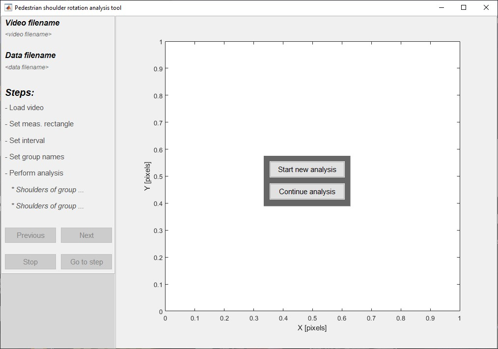
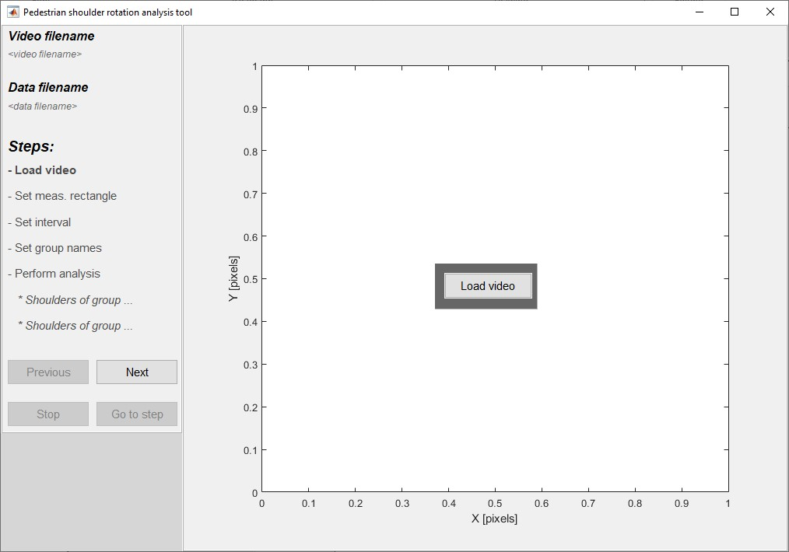
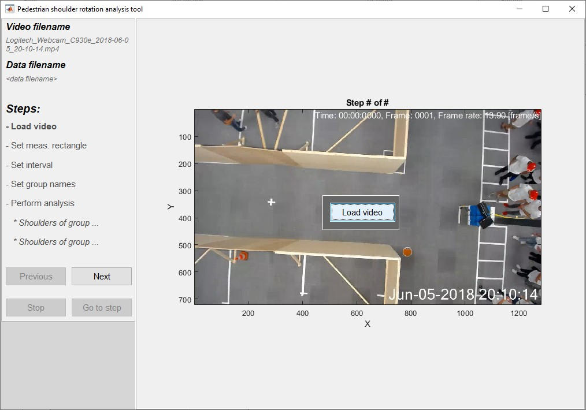
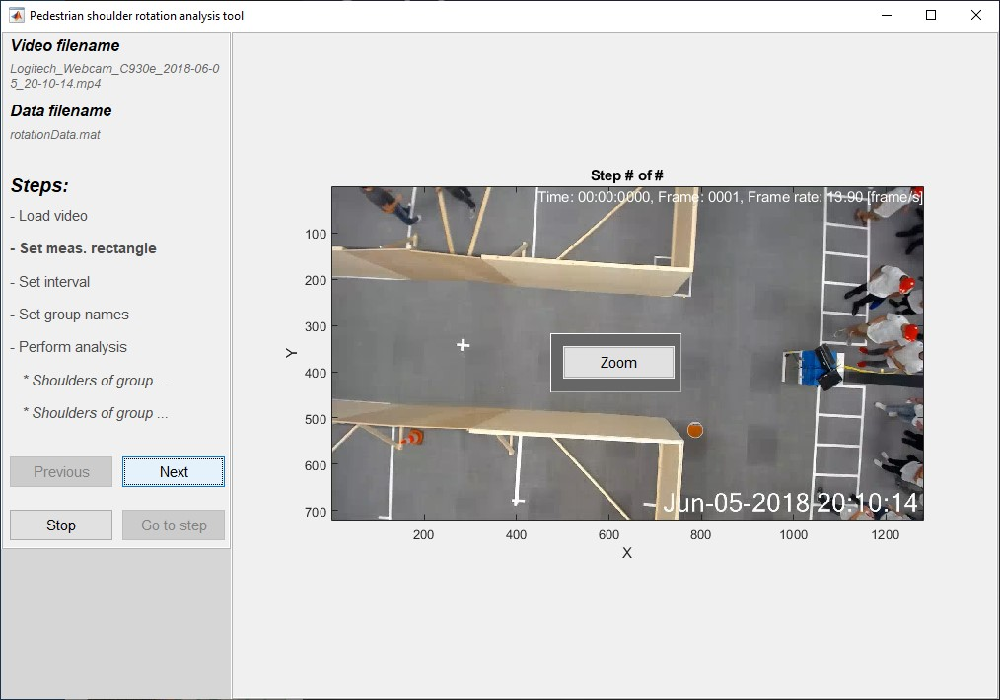
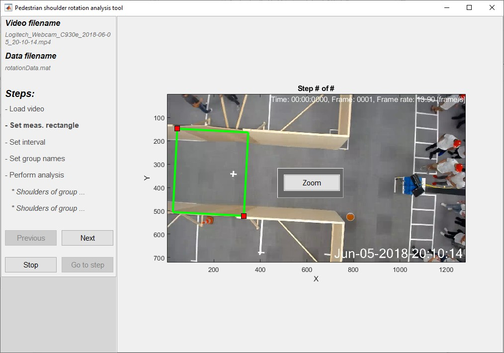
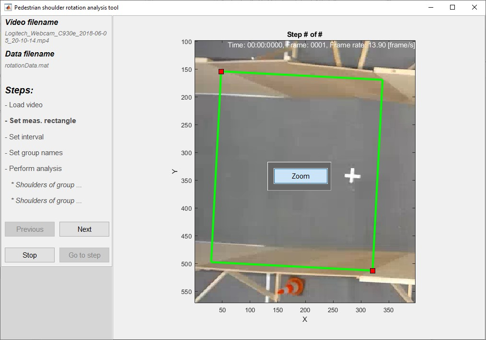
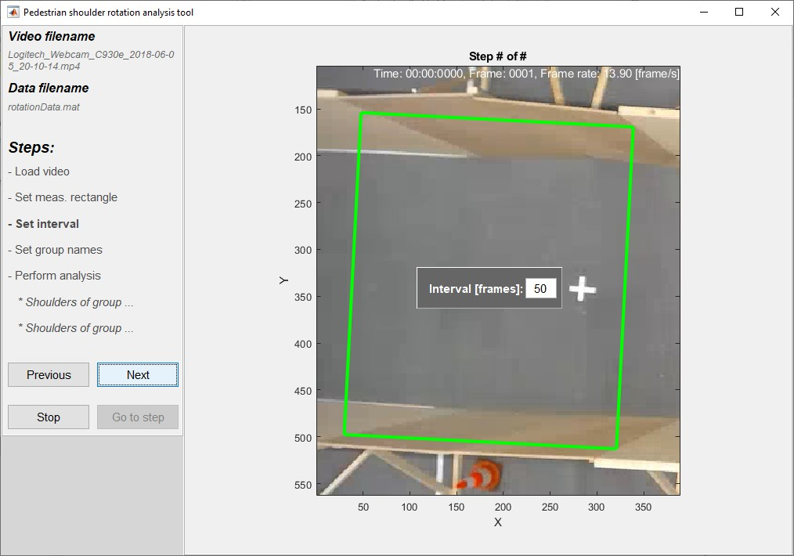
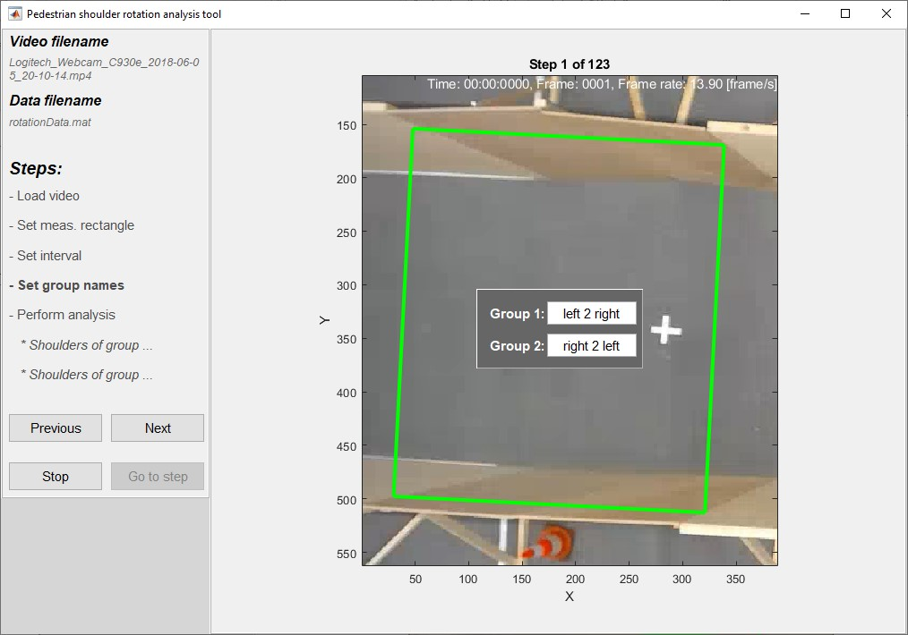
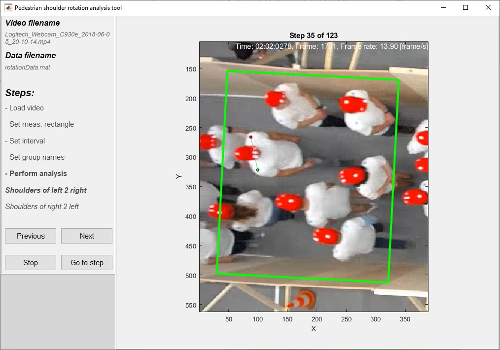

# Pedestrian Rotation Analysis Tool

The Pedestrian Rotation Analysis Tool is a small Matlab based tool that enables a user to obtain the upper body rotation of pedestrians.

## How to use

Start Matlab and set the current directory to directory containing the m-files (i.e. shoulderGui.m etc.). Next run shoulderGui.m, which should show the following window:

The start screen shows two options:
1. Start a new analysis
2. Continue an analysis

Both options are explained in more detail below.

### Start new analysis

#### Load video

Click the load video button to open a file open dialog and select the video file.

After succesfully loading the first frame of the video will be shown. The load another video click the load button again. 

After you have loaded the video, click next and a file dialog will open and ask you to select a file to which you want to save the analysis data. The structure of this output file and which data is saved in it is explained in more detail in the last part of this readme.

#### Set measurement rectangle

Now you have to draw a measurement rectangle by clicking on the picture and dragging the coner point that appears to draw a rectangle.   

Next and previous step consequences

#### Set interval

#### Set group names

#### Perform analysis

### Continue from existing analysis

## Output file format

The analysis data is saved to a mat-file whereby the data is a structure with the following fields:
1. video: A structure contaning information about the video data used for the analysis.
2. analysisStepCount: The number of frames that are part of the analysis provided the given interval and number of frames in the video.
3. interval: The analysis frame interval
4. lastStepWithProcessedData: The last analysis step that contains shoulder rotation data
5. rectangle: A structure contaning information about the desnity rectangle used for the analysis.
6. groups: An array with 2 stuctures (1 per group) containing the rotation data

The video, rectangle and group structures are explained in more detail below.

### Video data structure

### Rectangle data structure

### Groups data structure

