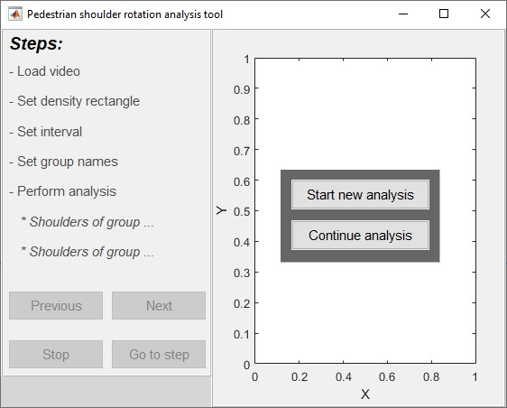

# Pedestrian Rotation Analysis Tool

The Pedestrian Rotation Analysis Tool is a small Matlab based tool that enables a user to obtain the upper body rotation of pedestrians.

## How to use

Start Matlab and set the current directory to directory containing the m-files (i.e. shoulderGui.m etc.). Next run shoulderGui.m, which should show the following window:

The start screen shows two options:
1. Start a new analysis
2. Continue an analysis

Both options are explained in more detail below.

### Start new analysis

#### Load video

process video data of pedestrians (presuming the video is taken from a bird's-eye perspective)

#### Set density rectangle

Next and previous step consequences

#### Set interval

#### Set group names

#### Perform analysis

### Continue from existing analysis

#### Perform analysis

## Output file format

The analysis data is saved to a mat-file whereby the data is a structure with the following fields:
1. video: A structure contaning information about the video data used for the analysis.
2. analysisStepCount: The number of frames that are part of the analysis provided the given interval and number of frames in the video.
3. interval: The analysis frame interval
4. lastStepWithProcessedData: The last analysis step that contains shoulder rotation data
5. rectangle: A structure contaning information about the desnity rectangle used for the analysis.
6. groups: An array with 2 stuctures (1 per group) containing the rotation data

The video, rectangle and group structures are explained in more detail below.

### Video data structure

### Rectangle data structure

### Groups data structure

